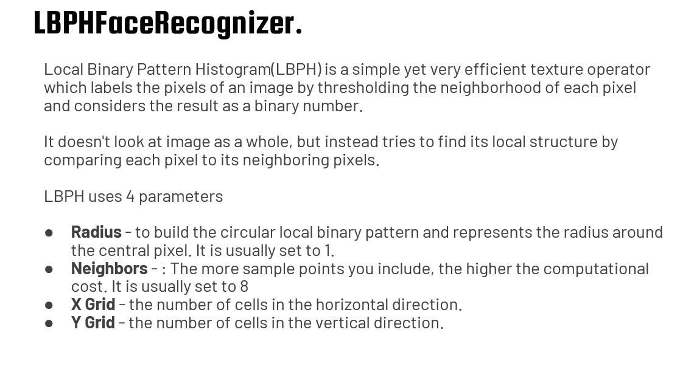
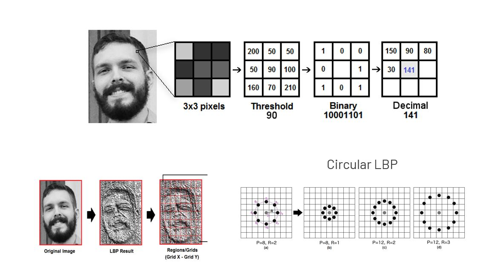
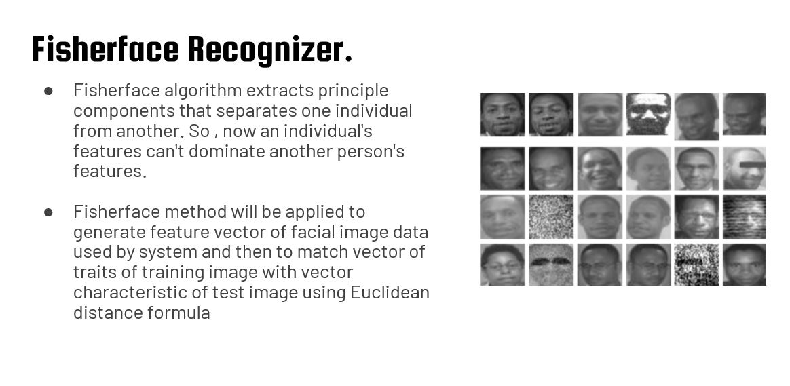
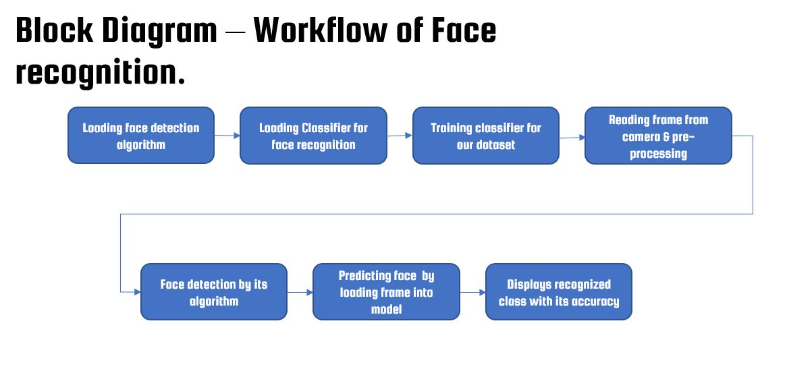
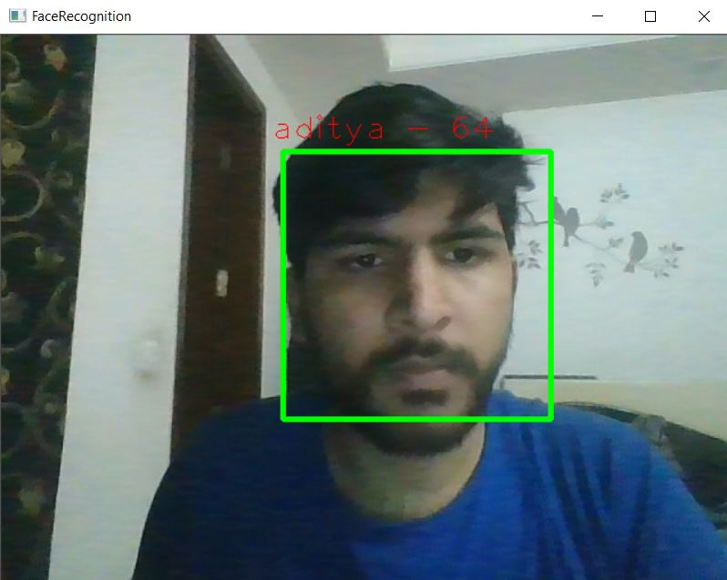
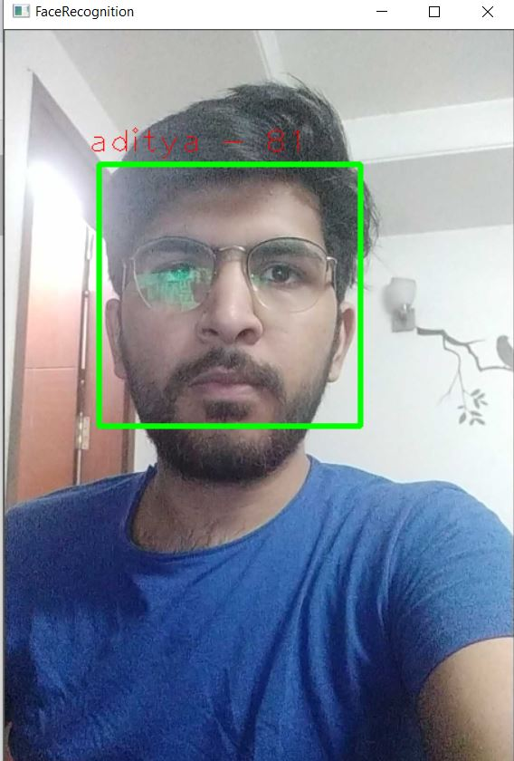

# Face recognition using OpenCV

this is a part of my 30 day journey to learn Artificial Intelligence by doing practical projects. On my 7th day I made this project.

## Alogorithms used for face recognition
### 1.

### 2.

## Steps Followed

## Output

### using android phone(download the app IP webcam)

